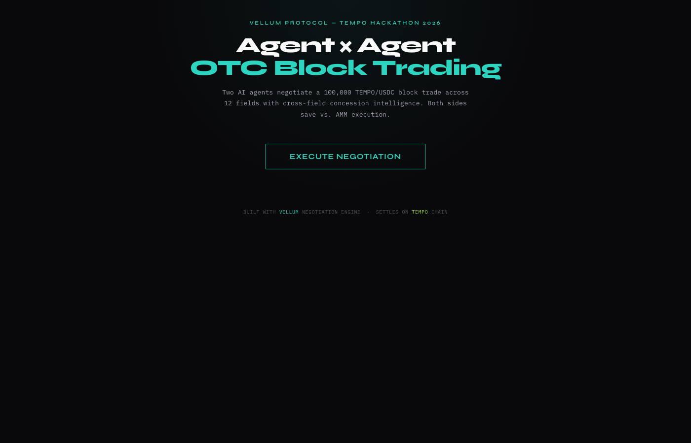

# Tempo Agentic Negotiator

Agentic OTC block trading for illiquid tokens. AI agents negotiate large block trades P2P using the [Vellum](https://github.com/mcevoyinit/vellum) negotiation engine, settling atomically on Tempo chain.



## Quick Start

```bash
# Backend
python -m venv .venv && source .venv/bin/activate
pip install -e ".[dev]"
uvicorn backend.app:app --reload --port 8000

# Frontend (separate terminal)
cd frontend && npm install && npm run dev
```

## Architecture

- **Vellum SDK** — General purpose negotiation engine (Python + React)
- **Policy Engine** — Hard guardrails: max spread, position limits, cross-field concessions
- **Agent Loop** — Observe, decide, act with human-in-the-loop escalation
- **Tempo Settlement** — Atomic on-chain settlement with content hash verification

## How it works

Two agents with competing objectives (best price vs best fill) negotiate a block trade across 12 fields at once: price, quantity, slippage tolerance, settlement window, tranche count, escrow terms, penalty rate, expiry, oracle source, and TWAP reference. The policy engine enforces cross-field concession logic (e.g. wider slippage tolerance if more tranches are offered). When both sides agree, the trade settles atomically on Tempo chain.
